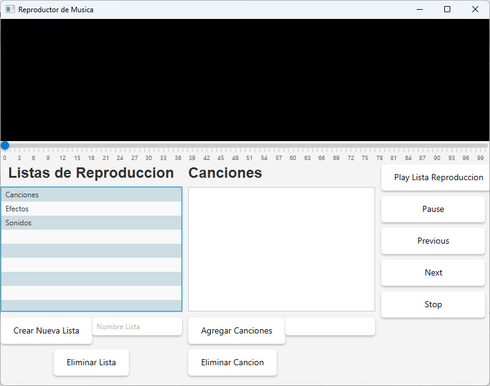

# Reproductor de Música

Este es un proyecto de un reproductor de música de escritorio desarrollado en JavaFX. La aplicación permite gestionar canciones y listas de reproducción, ofreciendo una interfaz gráfica amigable y controles de reproducción básicos.

## Descripción de la Aplicación

La aplicación permite realizar las siguientes funcionalidades:

- **Ver la lista de todas las canciones**: En la ventana principal se muestra una lista de canciones cargadas desde un archivo de texto.
- **Administrar listas de reproducción**: Permite crear, eliminar y seleccionar listas de reproducción desde un panel lateral.
- **Agregar o eliminar canciones en una lista de reproducción**: Las canciones pueden agregarse o eliminarse en las listas de reproducción para organizar la música.
- **Reproducir listas de reproducción**: Reproduce todas las canciones en una lista seleccionada, incluyendo opciones de control de reproducción (reproducir, pausar, detener, siguiente, anterior).
- **Ecualizador visual**: Muestra un ecualizador visual que responde al audio en reproducción.

## Arquitectura Modelo-Vista-Controlador (MVC)

Este proyecto sigue el patrón de diseño **MVC** para organizar y separar las responsabilidades de la aplicación. A continuación se describen los componentes de cada parte del patrón MVC:

### Modelo (Model)

Las clases en el modelo representan los datos de la aplicación y la lógica de negocio. En este caso, incluyen:

- **`Cancion`**: Representa una canción, con atributos como `nombre` y `ruta`.
- **`ListaReproduccion`**: Representa una lista de reproducción que contiene un conjunto de canciones.

Estas clases encapsulan los datos de la aplicación y proporcionan métodos para manipularlos.

### Vista (View)

Las clases de la vista son responsables de la interfaz gráfica del usuario y de la presentación de datos. En este proyecto, las vistas tienen el código mínimo y solo gestionan la presentación. Los principales componentes de la vista son:

- **`PrincipalView`**: La ventana principal que muestra la lista de canciones, el panel lateral con las listas de reproducción y los controles de reproducción.
- **`Ecualizador`**: Un ecualizador visual que responde al audio en reproducción.

Ambas vistas implementan la interfaz `InterReproductor` para recibir notificaciones desde el controlador de reproducción.

### Controlador (Controller)

Los controladores manejan la lógica de negocio y la coordinación entre la vista y el modelo. En este proyecto, tenemos los siguientes controladores:

- **`PrincipalController`**: Controla la lista principal de canciones, incluyendo la carga desde un archivo de texto y la gestión de canciones.
- **`ListaReproduccionController`**: Controla las listas de reproducción, permitiendo su creación, eliminación y manipulación de canciones.
- **`ReproductorController`**: Controla la reproducción de música, incluyendo las opciones de reproducción, pausa, reanudación, detención y navegación entre canciones.

Cada controlador actúa como intermediario entre la vista y el modelo, ejecutando las acciones solicitadas y actualizando la vista cuando es necesario.

## Capturas de Pantalla

A continuación se muestran algunas capturas de pantalla de la aplicación en funcionamiento:

### Ventana Principal

### Panel de Listas de Reproducción

### Reproducción de Música y Ecualizador

## Configuración del Proyecto

1. **JavaFX**: La aplicación está desarrollada en JavaFX. Asegúrate de configurar correctamente JavaFX en tu entorno de desarrollo para ejecutar la aplicación.
2. **Archivos de Música**: Las canciones deben estar en la ruta especificada en el archivo de texto de carga, y deben incluir tanto el nombre como la ruta del archivo.

## Ejecución de la Aplicación

Para ejecutar la aplicación, puedes ejecutar la clase `Reproductor` en el paquete `reproductor`, que es la clase principal de la aplicación. Esta clase inicializa la vista principal y abre la interfaz del reproductor de música.

## Contribuciones

Si deseas contribuir a este proyecto, puedes hacerlo mediante pull requests o proponiendo nuevas ideas en la sección de issues.

---

Este README proporciona una visión general del proyecto, sus funcionalidades y su estructura basada en el patrón MVC. Asegúrate de tener todas las dependencias y configuraciones adecuadas para ejecutar correctamente el reproductor de música.
